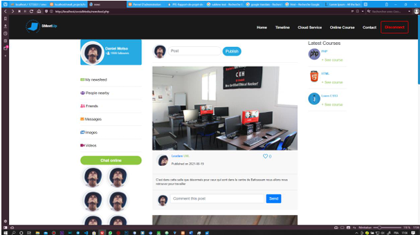
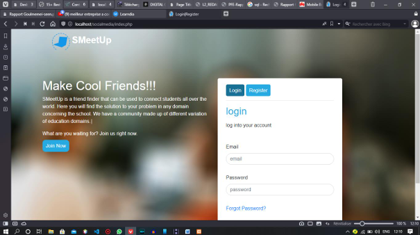
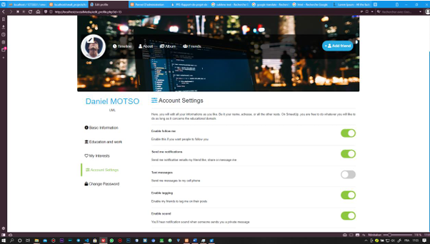
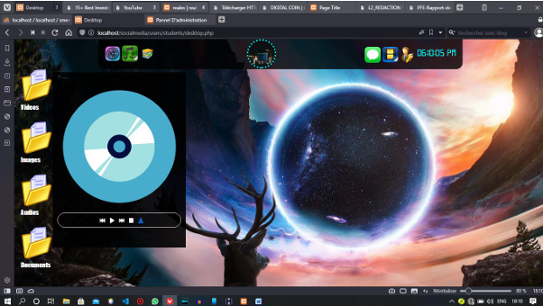
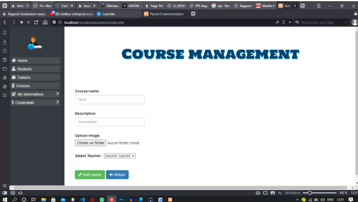
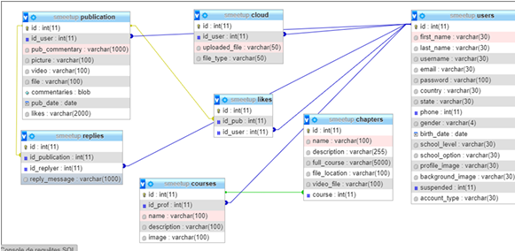

# 📚 E-Learning Platform – Projet universitaire

Ce projet a été réalisé dans le cadre de l'obtention du **Diplôme de Technicien Supérieur en Informatique** à l'IAI-Cameroun (Centre d’Excellence Technologique Paul BIYA) durant l’année académique **2020–2021**.  
Il a été développé au cours d’un stage effectué à **l’ONG BAHO Cameroun**.

## 🎯 Objectif du projet

Créer une **plateforme de E-Learning** intégrant :

- ✅ Un système de gestion de cours et formations
- ✅ Un espace de **stockage de données en ligne**
- ✅ Un module d’**interactions sociales** entre utilisateurs (type réseau social)

Le but est d’offrir un environnement numérique éducatif moderne, interactif et sécurisé, accessible à distance.

---

## 💻 Technologies utilisées

Le projet a été réalisé en suivant le modèle **MVC** avec les technologies suivantes :

- **PHP** (backend)
- **MySQL** (base de données)
- **HTML5/CSS3**
- **Bootstrap** (design responsive)
- **JavaScript**
- **jQuery**
- **Ajax**
- **SQL**
- **Camoo Host** (hébergement pour tests)

---

## 🧩 Fonctionnalités principales

### 🎓 E-Learning
- Création et gestion de cours par les formateurs
- Inscription et suivi des cours par les apprenants
- Téléchargement de fichiers pédagogiques

### 🗂️ Stockage de fichiers
- Espace personnel de stockage par utilisateur (images, vidéos, documents PDF)

### 💬 Réseau social intégré
- Publication de posts
- Réactions (likes), commentaires, messagerie privée
- Profil public pour chaque utilisateur

### 🔐 Administration
- Gestion des utilisateurs (apprenants, formateurs)
- Gestion des contenus
- Modération des publications

---

## 👤 Utilisateurs et rôles

- **Administrateur**
- **Formateur**
- **Apprenant**

Chaque rôle a des privilèges distincts dans le système.

---

## 🧪 Captures d’écran (à insérer)

### 🟢 Page d’accueil


### 🔐 Interface de Connexion


### ⚙️ Paramètres du profil utilisateur


### 📁 Gestion de fichiers


### 📚 Espace des cours


### 🧩 Diagramme de la base de données



---

## 🚀 Installation locale (optionnelle)

1. Cloner ce dépôt :

```bash
git clone https://github.com/amrampro/e-learning-platform-2021.git
